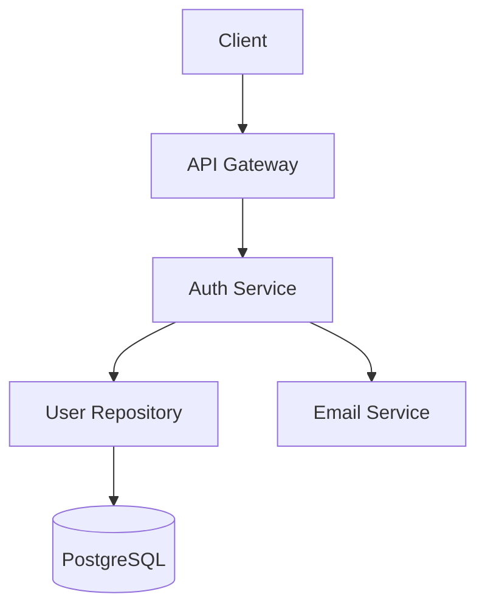

# The LDF SAIL Methodology

> **Research Date**: December 2025
> **Branch**: `research/ink-react-cli`
> **Status**: Approved
> **Tagline**: *"SAIL from idea to iteration"*

---

## Overview

**SAIL** is a 4-phase product-led development methodology designed for AI-assisted software development. Unlike traditional methodologies that treat deployment as an endpoint, SAIL explicitly builds continuous learning and iteration into its core structure.

```
S → A → I → L
Scope → Architect → Implement → Learn
```

---

## The SAIL Cycle

```
    ┌─────────────────────────────────────────┐
    │                                         │
    ▼                                         │
  SCOPE ──→ ARCHITECT ──→ IMPLEMENT ──→ LEARN ┘
    │                                    │
    │         (Learnings inform          │
    │          next iteration)           │
    └────────────────────────────────────┘
```

Each iteration of SAIL produces working software that generates learnings, which inform the next cycle. This is not a waterfall - it's a continuous voyage with course corrections.

---

## Why SAIL?

### Design Principles

1. **Product-First, Not Code-First**
   - "Scope" phase ensures product thinking happens before design
   - User stories and acceptance criteria drive everything

2. **Iteration is Built-In, Not Bolted-On**
   - "Learn" phase explicitly closes the feedback loop
   - Learnings flow back into the next Scope phase

3. **Clear Phase Boundaries**
   - Each phase has distinct purpose and artifacts
   - Handoffs between phases are well-defined

4. **AI-Agent Aligned**
   - Each phase maps to specialized AI agents
   - Context isolation enables focused work

5. **Not Stretched for Acronym**
   - 4 phases is the right granularity
   - No artificial subdivision to fit a word

### Comparison to Other Methodologies

| Methodology | Phases | Iteration? | PM Focus? | AI-Ready? |
|-------------|--------|------------|-----------|-----------|
| SAIL | 4 | ✅ Built-in ("Learn") | ✅ "Scope" phase | ✅ Agent-aligned |
| SPARC | 5 | ⚠️ Implicit | ⚠️ Dev-focused | ⚠️ Not designed for agents |
| Waterfall | 5-7 | ❌ Linear | ⚠️ Requirements phase | ❌ Not designed for AI |
| Scrum | Sprints | ✅ Sprint cycles | ✅ User stories | ⚠️ Not agent-specific |
| Kanban | Continuous | ✅ Flow-based | ⚠️ Task-focused | ⚠️ Not agent-specific |

---

## Phase 1: Scope

**Purpose**: Define what we're building and why.

```
┌─────────────────────────────────────────────────────────────┐
│  SCOPE PHASE                                                │
├─────────────────────────────────────────────────────────────┤
│                                                             │
│  Inputs:                                                    │
│  • Business requirements                                    │
│  • User research / feedback                                 │
│  • Learnings from previous iterations                       │
│                                                             │
│  Activities:                                                │
│  • Define project boundaries                                │
│  • Gather user stories                                      │
│  • Write acceptance criteria                                │
│  • Establish success metrics                                │
│  • Identify constraints and dependencies                    │
│  • Create TDD anchors (test-first thinking)                 │
│                                                             │
│  Outputs:                                                   │
│  • requirements.md                                          │
│  • user-stories.yaml                                        │
│  • acceptance-criteria.md                                   │
│  • success-metrics.md                                       │
│                                                             │
│  Agent: 📋 Product Agent (Scope Mode)                       │
│                                                             │
└─────────────────────────────────────────────────────────────┘
```

### Key Questions

- What problem are we solving?
- Who are we solving it for?
- How will we know we succeeded?
- What's in scope vs out of scope?
- What dependencies exist?

### Artifacts

#### requirements.md

```markdown
# Feature: User Authentication

## Overview
Enable users to securely register and log in to the platform.

## Scope
### In Scope
- Email/password registration
- Login with session management
- Password reset flow

### Out of Scope
- Social login (OAuth)
- Two-factor authentication
- Biometric authentication

## Dependencies
- Email service integration
- Database for user storage

## Constraints
- Must comply with GDPR
- Password storage must use bcrypt

## Success Metrics
- Registration completion rate > 90%
- Login success rate > 99%
- Password reset completion < 5 minutes
```

#### user-stories.yaml

```yaml
stories:
  - id: US-001
    title: User Registration
    as_a: new visitor
    i_want_to: create an account with my email
    so_that: I can access the platform's features
    acceptance_criteria:
      - AC-001: Email must be valid and unique
      - AC-002: Password must meet complexity requirements
      - AC-003: Confirmation email sent within 30 seconds
    priority: high
    points: 5
    labels: [auth, mvp]
    tdd_anchors:
      - "GIVEN valid email WHEN register THEN account created"
      - "GIVEN existing email WHEN register THEN error shown"

  - id: US-002
    title: User Login
    as_a: registered user
    i_want_to: log in with my credentials
    so_that: I can access my account
    acceptance_criteria:
      - AC-004: Valid credentials grant access
      - AC-005: Invalid credentials show error
      - AC-006: Session persists for 24 hours
    priority: high
    points: 3
    labels: [auth, mvp]
```

### TDD Anchors

SAIL integrates test-driven development from the Scope phase, not as an afterthought:

```markdown
## TDD Anchors

### Test Case Outline
- [ ] TC-001: Valid registration creates user → drives UserService.register()
- [ ] TC-002: Invalid email rejected → drives EmailValidator
- [ ] TC-003: Duplicate email rejected → drives UserRepository.exists()

### Acceptance Test Scenarios
- [ ] AT-001: GIVEN new user WHEN registers with valid email THEN receives confirmation
- [ ] AT-002: GIVEN existing email WHEN registers THEN sees error message
```

---

## Phase 2: Architect

**Purpose**: Design how we'll build it.

```
┌─────────────────────────────────────────────────────────────┐
│  ARCHITECT PHASE                                            │
├─────────────────────────────────────────────────────────────┤
│                                                             │
│  Inputs:                                                    │
│  • requirements.md                                          │
│  • user-stories.yaml                                        │
│  • TDD anchors                                              │
│                                                             │
│  Activities:                                                │
│  • Design system architecture                               │
│  • Define data models                                       │
│  • Create API contracts                                     │
│  • Write pseudocode for complex logic                       │
│  • Document technical decisions                             │
│  • Create architecture diagrams                             │
│                                                             │
│  Outputs:                                                   │
│  • design.md                                                │
│  • architecture/ (diagrams)                                 │
│  • decisions.md                                             │
│  • pseudocode.md (optional)                                 │
│                                                             │
│  Agent: 📐 Architect Agent                                  │
│                                                             │
└─────────────────────────────────────────────────────────────┘
```

### Key Questions

- What's the system structure?
- How do components interact?
- What data models are needed?
- What APIs will be exposed?
- What technical tradeoffs exist?

### Artifacts

#### design.md

```markdown
# Design: User Authentication

## System Architecture



## Data Models

### User
| Field | Type | Constraints |
|-------|------|-------------|
| id | UUID | Primary key |
| email | string | Unique, indexed |
| password_hash | string | bcrypt |
| created_at | timestamp | Not null |
| verified_at | timestamp | Nullable |

## API Contracts

### POST /auth/register
Request:
```json
{
  "email": "user@example.com",
  "password": "SecureP@ss123"
}
```

Response (201):
```json
{
  "user_id": "uuid",
  "message": "Verification email sent"
}
```

## Security Considerations
- Passwords hashed with bcrypt (cost factor 12)
- Rate limiting: 5 registration attempts per IP per hour
- Input validation on all endpoints
```

#### decisions.md

```markdown
# Technical Decisions

## Decision 1: Password Hashing Algorithm

### Context
Need to securely store user passwords.

### Options Considered
1. **bcrypt** - Industry standard, configurable cost factor
2. **Argon2** - Newer, memory-hard
3. **PBKDF2** - Widely supported, but slower

### Decision
**bcrypt** with cost factor 12.

### Rationale
- Well-tested and widely understood
- Good balance of security and performance
- Extensive library support in our stack

### Consequences
- Must upgrade cost factor periodically
- 200-300ms per hash operation
```

---

## Phase 3: Implement

**Purpose**: Build the solution with TDD.

```
┌─────────────────────────────────────────────────────────────┐
│  IMPLEMENT PHASE                                            │
├─────────────────────────────────────────────────────────────┤
│                                                             │
│  Inputs:                                                    │
│  • design.md                                                │
│  • TDD anchors from Scope                                   │
│  • API contracts                                            │
│                                                             │
│  Activities:                                                │
│  • Write tests first (TDD)                                  │
│  • Implement features                                       │
│  • Security review                                          │
│  • Code review                                              │
│  • Performance optimization                                 │
│  • Integration testing                                      │
│                                                             │
│  Outputs:                                                   │
│  • Source code                                              │
│  • Test suites                                              │
│  • security-report.md                                       │
│  • coverage-report.md                                       │
│                                                             │
│  Agents: ⚡ Coder + 🧪 Tester + 🛡️ Security                │
│                                                             │
└─────────────────────────────────────────────────────────────┘
```

### TDD Workflow

1. **Red**: Write a failing test from TDD anchor
2. **Green**: Write minimal code to pass
3. **Refactor**: Improve without breaking tests
4. **Repeat**: Move to next TDD anchor

### Agent Collaboration

```
┌─────────────────────────────────────────────────────────────┐
│  IMPLEMENT PHASE - AGENT COLLABORATION                      │
├─────────────────────────────────────────────────────────────┤
│                                                             │
│  ⚡ Coder Agent                                              │
│  ├── Receives: design.md, TDD anchors                       │
│  ├── Writes: Feature code, follows architecture             │
│  └── Returns: Implemented modules                           │
│                                                             │
│  🧪 Tester Agent                                             │
│  ├── Receives: TDD anchors, acceptance criteria             │
│  ├── Writes: Unit tests, integration tests                  │
│  └── Returns: Test suites, coverage report                  │
│                                                             │
│  🛡️ Security Agent                                           │
│  ├── Receives: Source code, API contracts                   │
│  ├── Reviews: OWASP top 10, injection, auth                 │
│  └── Returns: Security report, recommendations              │
│                                                             │
└─────────────────────────────────────────────────────────────┘
```

### Quality Gates

Before exiting Implement phase:
- [ ] All TDD anchors covered by tests
- [ ] All acceptance criteria have tests
- [ ] Code coverage > 80%
- [ ] Security review complete
- [ ] No critical/high vulnerabilities
- [ ] All tests passing
- [ ] Code review approved

---

## Phase 4: Learn

**Purpose**: Deploy, observe, and iterate.

```
┌─────────────────────────────────────────────────────────────┐
│  LEARN PHASE                                                │
├─────────────────────────────────────────────────────────────┤
│                                                             │
│  Inputs:                                                    │
│  • Implemented features                                     │
│  • Success metrics from Scope                               │
│  • Test suites                                              │
│                                                             │
│  Activities:                                                │
│  • Deploy to staging/production                             │
│  • Monitor performance and errors                           │
│  • Gather user feedback                                     │
│  • Analyze metrics against success criteria                 │
│  • Document learnings                                       │
│  • Identify improvements for next iteration                 │
│                                                             │
│  Outputs:                                                   │
│  • deployment.md                                            │
│  • monitoring.md                                            │
│  • learnings.md                                             │
│  • Next iteration inputs                                    │
│                                                             │
│  Agents: 🚀 Deploy + 📊 Monitor                             │
│                                                             │
└─────────────────────────────────────────────────────────────┘
```

### Key Questions

- Did we meet our success metrics?
- What unexpected issues occurred?
- What user feedback did we receive?
- What should we do differently next time?
- What's the priority for the next iteration?

### Artifacts

#### learnings.md

```markdown
# Learnings: User Authentication v1.0

## Deployment Summary
- Deployed: 2025-01-15
- Environment: Production
- Rollout: 10% → 50% → 100% over 3 days

## Metrics vs Goals

| Metric | Goal | Actual | Status |
|--------|------|--------|--------|
| Registration completion | >90% | 87% | ⚠️ Below |
| Login success rate | >99% | 99.2% | ✅ Met |
| Password reset time | <5 min | 3.2 min | ✅ Met |

## Key Observations

### What Went Well
- Login flow smooth, no major issues
- Password reset significantly faster than expected
- Security audit passed with no issues

### What Didn't Go Well
- Registration completion 3% below target
- Users dropping off at password complexity step
- Error messages not helpful enough

### Root Cause Analysis
Registration drop-off caused by:
1. Password requirements not shown upfront
2. Error messages too technical
3. No real-time validation feedback

## Recommendations for Next Iteration

### High Priority
1. Show password requirements before user types
2. Add real-time password strength indicator
3. Improve error message clarity

### Medium Priority
4. Add progress indicator for registration flow
5. A/B test shorter registration form

## Next Scope Inputs
- [ ] US-010: Password strength indicator
- [ ] US-011: Improved error messaging
- [ ] US-012: Registration progress indicator
```

### The Feedback Loop

The Learn phase generates inputs for the next Scope phase:

```
LEARN Phase Outputs          →  Next SCOPE Phase Inputs
─────────────────────────────────────────────────────────
learnings.md recommendations →  New user stories
Metrics analysis             →  Updated success criteria
User feedback                →  Refined requirements
Technical debt identified    →  Architecture updates
```

This closes the loop and ensures continuous improvement.

---

## SAIL in Practice

### Sprint Structure

A typical 2-week sprint using SAIL:

| Days | Phase | Activities |
|------|-------|------------|
| 1-2 | Scope | Requirements refinement, story writing, TDD anchors |
| 3-4 | Architect | Design, decisions, diagrams |
| 5-10 | Implement | TDD cycles, code review, security |
| 11-12 | Learn | Deploy, monitor, document learnings |
| 13-14 | Buffer | Bug fixes, retrospective, next sprint planning |

### Scaling SAIL

For larger projects, SAIL phases can overlap:

```
Week 1: [SCOPE: Epic 1] [ARCHITECT: Epic 1]
Week 2: [IMPLEMENT: Epic 1] [SCOPE: Epic 2]
Week 3: [IMPLEMENT: Epic 1] [ARCHITECT: Epic 2]
Week 4: [LEARN: Epic 1] [IMPLEMENT: Epic 2]
Week 5: [SCOPE: Epic 3] [LEARN: Epic 2]
```

### SAIL Modes (Abbreviated)

For quick iterations or hotfixes:

| Mode | Phases | Use Case |
|------|--------|----------|
| Full SAIL | S → A → I → L | New features, major changes |
| SAIL Lite | S → I → L | Small features, clear requirements |
| SAIL Fix | I → L | Bug fixes, no design needed |

---

## LDF Integration

### Spec Structure

```
.ldf/specs/{feature}/
├── requirements.md         # S: Scope outputs
├── user-stories.yaml       # S: Stories in export format
├── design.md               # A: Architecture outputs
├── architecture/           # A: Diagrams
├── decisions.md            # A: Technical decisions
└── learnings.md            # L: Iteration learnings
```

### Agent Mapping

| SAIL Phase | Primary Agent | Supporting Agents |
|------------|---------------|-------------------|
| Scope | 📋 Product Agent | 🔍 Explorer |
| Architect | 📐 Architect Agent | 📚 Docs |
| Implement | ⚡ Coder Agent | 🧪 Tester, 🛡️ Security |
| Learn | 📊 Monitor Agent | 🚀 Deploy |

### CLI Integration

```bash
# Phase-aware commands
ldf sail scope start          # Begin Scope phase
ldf sail scope complete       # Complete with validation

ldf sail architect start      # Begin Architect phase
ldf sail architect validate   # Validate design

ldf sail implement start      # Begin Implement phase
ldf sail implement tdd-check  # Check TDD coverage

ldf sail learn deploy         # Deploy and begin Learn
ldf sail learn document       # Generate learnings template
```

---

## Summary

SAIL is designed for modern AI-assisted development:

| Aspect | SAIL Approach |
|--------|---------------|
| **Philosophy** | Product-led, iteration-focused |
| **Phases** | 4 distinct phases with clear handoffs |
| **Iteration** | Built-in via "Learn" phase |
| **Testing** | TDD anchors from Scope |
| **AI Agents** | One primary agent per phase |
| **Artifacts** | Standardized, exportable |

*"SAIL from idea to iteration"*

---

## Related Documents

- [LDF Evolution Overview](./ldf-evolution-overview.md)
- [Agent Architecture](./agent-architecture.md)
- [Ink + React CLI Migration](./ink-react-cli-migration-v2.md)
